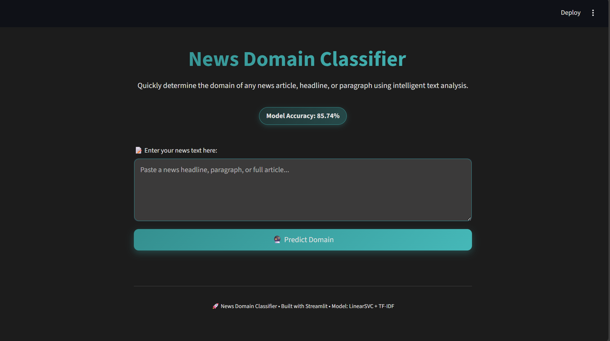
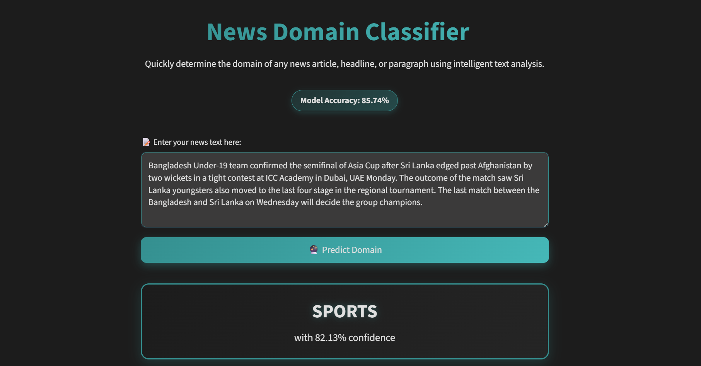
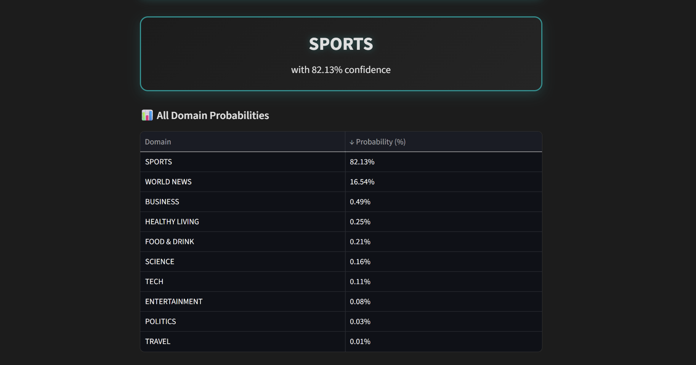

# 📰 News Domain Classifier

An NLP-powered web application using machine learning to instantly predict the **domain/category** of any news article, headline, or paragraph.

Built with **Streamlit** for an intuitive interface and **scikit-learn** (LinearSVC with TF-IDF) for accurate multi-class classification.

## ✨ Features

- Predicts news domain from multiple categories (Sports, Tech, Business, Politics, Entertainment, World News, Healthy Living, Science, Food & Drink, Travel)
- Displays the **predicted domain** with confidence percentage
- Shows the **full probability distribution** across all domains in a beautifully styled table
- Modern dark theme with teal accents (`#088f8f` on `#1c1c1c`)
- Clean, responsive, and compact UI optimized for all screens
- Model accuracy: **85.74%** on test set

## 🖼️ Screenshots

  
  
  

## 🛠️ Tech Stack

### Backend
- Python
- scikit-learn (LinearSVC + CalibratedClassifierCV for reliable probability outputs)
- TF-IDF Vectorization (unigrams + bigrams, max_features=30,000)
- NLTK for text preprocessing (tokenization, stopword removal)
- Pandas for data handling

### Frontend
- Streamlit (custom-styled with CSS and Pandas Styler for dark theme and interactive elements)

### Model Details
- Trained on custom multi-domain news dataset (`domain_classification_dataset.csv`)
- Text preprocessing: lowercase, punctuation removal, stopword removal, tokenization
- Features: TF-IDF with `ngram_range=(1,2)`, `min_df=2`, `max_df=0.95`
- Classifier: LinearSVC (`C=0.5`, `class_weight='balanced'`)
- Calibrated with CalibratedClassifierCV (`cv=3`) for probability scores
- Stratified train-test split (80/20)
